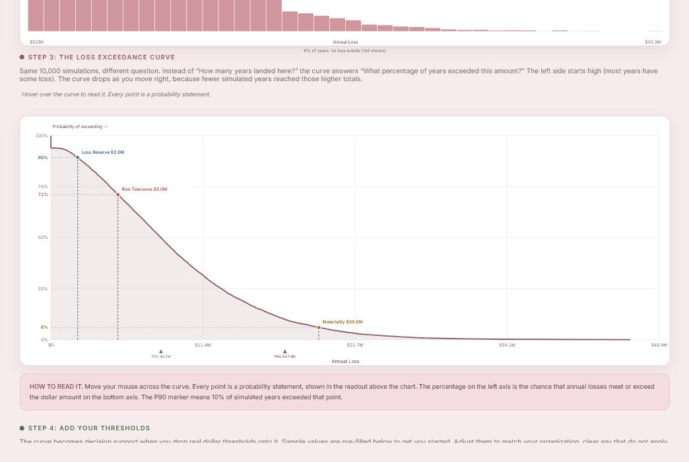

# Loss Exceedance Curve

An interactive guide to reading a loss exceedance curve — the chart that answers
"what are the odds we lose more than $X?" Build a curve from a Monte Carlo
simulation, then drop real dollar thresholds onto it and read the probability
straight off the axis.

**Live:** https://xnasusx.github.io/loss-exceedance-curve/



## What it does

1. **Define a risk** — three-point estimates (min / most likely / max) for how
   often the risk occurs per year and how much each event costs.
2. **Run 10,000 simulations** — a PERT distribution for severity, Poisson for
   event counts, summed into an annual loss for each simulated year.
3. **Read the histogram** — the shape of the risk, plus P50 / mean / P90.
4. **Transform into the exceedance curve** — same data, different question.
   Hover anywhere on the curve for a plain-English probability statement.
5. **Add thresholds** — risk tolerance, loss reserve, materiality, and one
   threshold you name yourself. Each renders on the curve and generates a
   sentence you could put in a board deck.

Dollar inputs accept shorthand: `500K`, `5M`, `1.5B`.

## Styling

Restyled to match the palette and typography of my portfolio:

| Role | Value |
| --- | --- |
| Paper | `#F7EBED` |
| Panel | `#FFFFFF` |
| Ink | `#3A3336` |
| Accent (rose) | `#8D5860` |
| Amber | `#9A6A24` |
| Sage | `#4C7359` |
| Display type | Fraunces |
| UI + body type | Inter |

The four threshold colors were remapped from the original's saturated
red/blue/orange/purple to muted tones that sit in the rose palette: brick
`#B04A44`, steel `#4A6B8A`, amber `#9A6A24`, plum `#7C5A86`.

## Running locally

No build step — it's one self-contained HTML file that pulls React 18 from a CDN.

```bash
python -m http.server 8000
```

Then open http://localhost:8000. Opening `index.html` directly from the
filesystem works too.

## A note on the model

This is a teaching demo, not a production risk model. PERT distributions have
hard upper bounds, while real cyber losses tend to be fat-tailed — so the tool
structurally underestimates tail risk. 10,000 iterations is fine for learning;
production models typically run 50,000–100,000 for stable tail estimates.

## License

Copyright (c) 2026 Susan Shepard.

[GNU AGPL v3 or later](LICENSE). If you modify this and run it as a network service, the AGPL requires you to offer your users the modified source under the same terms.
